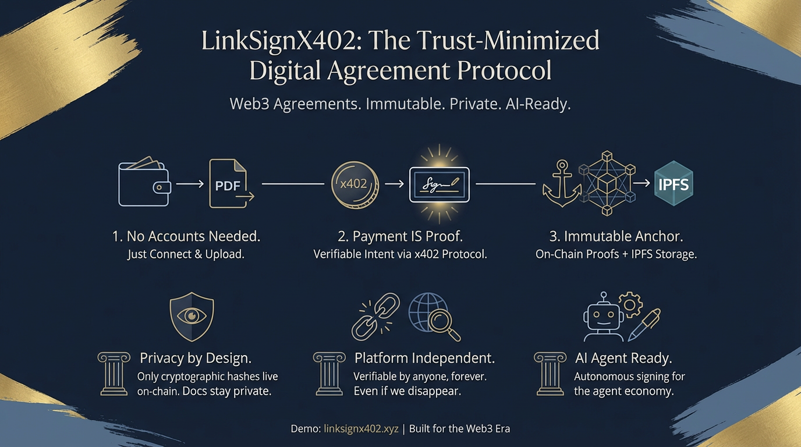

# LinkSignX402


> **The Trust-Minimized Digital Agreement Protocol.**

LinkSignX402 is a decentralized agreement protocol built for the Web3 era. It allows anyone to upload a PDF, pay a small fee via **x402**, and anchor an immutable proof of existence and **multiple signatures** on the **blockchain**.

**Demo:** [https://linksignx402.xyz](https://linksignx402.xyz)

---

## Why LinkSignX402?
Traditional e-signature platforms rely on centralized databases, private accounts, and "trust us" models. LinkSignX402 flips this:

- **No Accounts:** Connect your wallet, upload, and sign. No emails or passwords required.
- **Privacy by Design:** Documents are pinned to IPFS; only cryptographic hashes and payment references live on-chain.
- **Payment-Backed Intent:** We leverage the **x402 protocol** to make the payment itself a verifiable part of each signature process.
- **Platform Independence:** Your agreements survive even if we disappear. Everything is verifiable using only public blockchain data and IPFS.

---

## Design Decisions (The "Why")

### 1. x402: Payment IS the Proof
We use the **x402 HTTP Payment Protocol**. Instead of complex checkout flows, protected API endpoints return a `402 Payment Required` response.
- **Cryptographic Intent:** The user signs an EIP-712 authorization to pay.
- **Relayer Friendly:** Because we verify via **ERC-20 Transfer logs** in the `paymentRef` transaction, the payment can be broadcast by a facilitator while still proving the intent of the original wallet.

### 2. IPFS: Content-Addressed Integrity
Documents are stored on IPFS. Because IPFS is content-addressed, the **CID (Content Identifier)** is directly tied to the file bytes. If even a single comma in the PDF changes, the CID changes, immediately breaking the link to the on-chain record.

### 3. On-chain Registry
A slim smart contract acts as the "Source of Truth," emitting events that link:
- **Agreement ID:** A deterministic hash of `(docHash, creator, paymentRef)`.
- **docHash:** The keccak256 fingerprint of the file.
- **paymentRef:** The transaction hash of the x402 payment.

---

## Trust Model (Independent Verification)
You don't need to trust our backend. Any third party can verify an agreement's validity:

1. **Query Blockchain:** Read `AgreementCreated` and all `AgreementSigned` events from the contract.
2. **Fetch File:** Download the PDF from IPFS using the `cid` from the event.
3. **Verify Integrity:** Confirm `keccak256(file) == docHash`.
4. **Verify Payment:** Confirm the `paymentRef` transaction receipt contains a valid USDC Transfer to our `PAY_TO_ADDRESS`.

**If any check fails, the agreement is tampered or fraudulent.**

---

## AI Agent Ready
The x402 protocol makes LinkSignX402 a **first-class citizen in the agent economy**. AI agents can autonomously create and sign agreements without human intervention:

1. **Agent requests** `POST /api/create` or `POST /api/sign`
2. **Server responds** with `402 Payment Required` + payment details
3. **Agent pays** (signs EIP-712 authorization, facilitator settles)
4. **Agent retries** the request with payment proof
5. **Agreement is created/signed** on-chain

This is the power of x402: **any HTTP client that can hold a wallet can transact**. No OAuth, no API keys, no subscription management. Just standard HTTP + crypto signatures.

Use cases unlocked:
- **Autonomous contract negotiation:** AI agents drafting and signing agreements on behalf of users
- **Multi-agent workflows:** Multiple AI agents co-signing documents programmatically
- **24/7 operations:** Agents creating binding agreements while humans sleep

---

## Engineering Highlights
We went beyond standard implementations to handle real-world Web3 UX and edge runtime constraints:

- **Manual x402 Settlement:** Standard middlewares settle payments *after* the request handler. We implemented a custom flow to obtain the real `txHash` **upfront**, allowing us to include the payment reference inside the smart contract event in a single atomic-feeling operation.
- **Lazy Facilitator Init:** To support **Cloudflare Workers** (which don't support top-level await), we built a lazy-initialization wrapper for the x402 resource server that triggers only on the first protected request.
- **Deterministic Collision-Resistant IDs:** Agreement IDs are derived using `abi.encode` and `keccak256`, ensuring a unique and stable identifier that links the creator, the file, and the specific payment.

---

## Technical Stack
- **Frontend:** React + TanStack Router (SSR-ready)
- **Backend:** Hono on Cloudflare Workers
- **Payments:** x402 Protocol (`@x402/fetch` & `@x402/hono`)
- **Storage:** IPFS (Pinata)
- **Blockchain:** EVM-compatible (Viem / Wagmi)

---

## Getting Started

### Prerequisites
1. **Node.js & pnpm**
2. **WalletConnect Project ID** (from [cloud.reown.com](https://cloud.reown.com))
3. **Pinata JWT** (for IPFS pinning)

### Installation
```bash
pnpm install
```

### Configuration
1. Copy `.env.example` to `.env`.
2. Fill in the required secrets (CDP API Keys, Pinata JWT, Server Wallet Private Key).
3. Ensure `PAY_TO_ADDRESS` and `CONTRACT_ADDRESS` are set correctly for your target blockchain.

### Development
```bash
pnpm dev
```

### Build
```bash
pnpm build
```

---

## License
MIT
